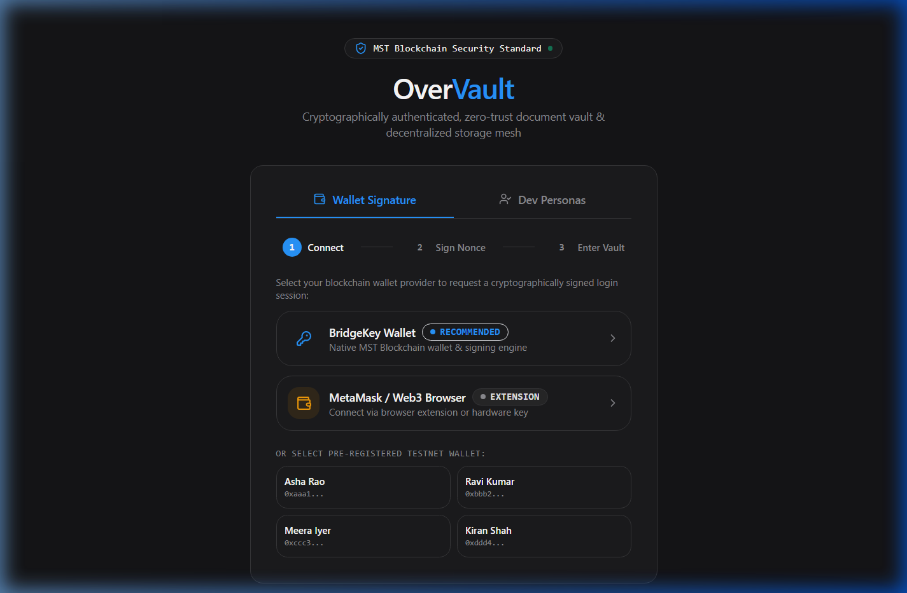
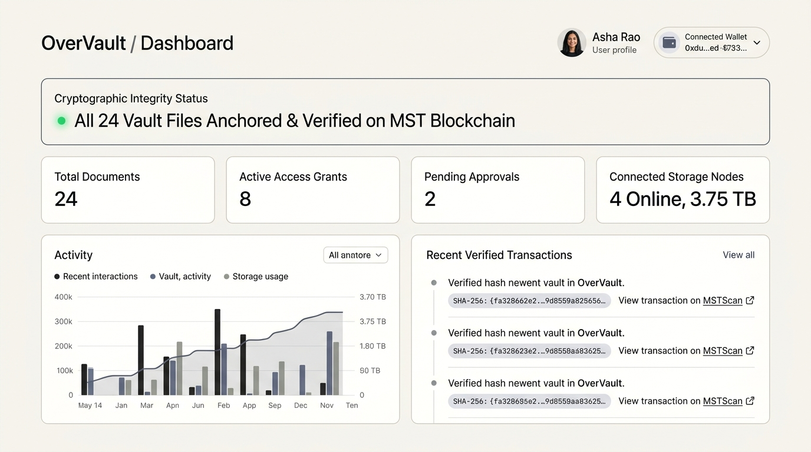
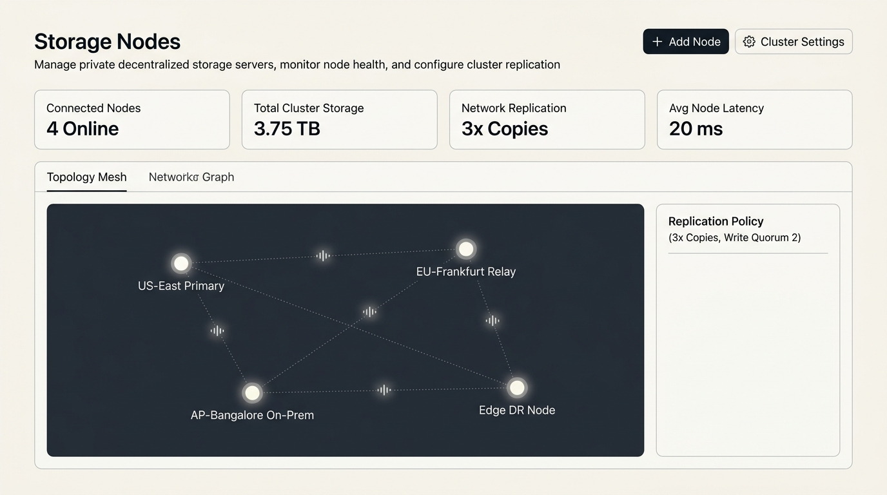
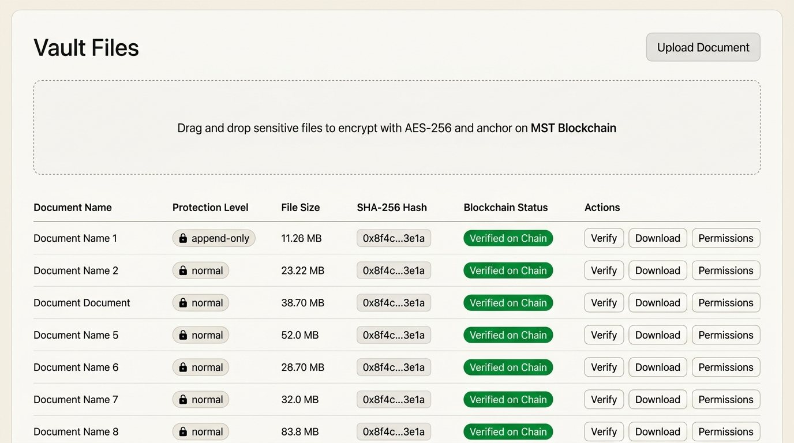
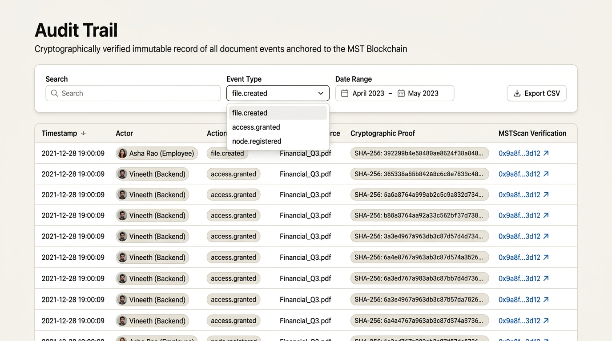

# OverVault (MST Vault)

> **Enterprise-Grade Blockchain-Audited Decentralized Document Vault & Private Storage Mesh**  
> Anchored to the **MST Blockchain** with **BridgeKey Wallet** zero-knowledge cryptographic signing.  
> *Private files never touch the chain — only cryptographic hashes, access grants, and audit proofs do.*

---

## 📸 System Interface & Live Showcase

### 1. Cryptographic Wallet Authentication & Identity Provisioning
Zero-knowledge authentication powered by **BridgeKey Wallet** and **Web3 Browser Wallets** (MetaMask, Brave). Teammates on the local network connect securely with their own display names and unique persistent cryptographic wallets, isolating vaults under strict zero-trust boundaries.


---

### 2. Executive Security & Integrity Dashboard
The operational command center tracking cryptographic file proofs, active storage allocation, peer access grants, pending multi-sig reviews, and real-time MSTScan transaction commits.


---

### 3. Private Decentralized Storage Node Network
Decentralized physical data sovereignty cluster. Organizations connect servers and computers across regions into an encrypted storage mesh with interactive topology visualization, health telemetry, and quorum replication controls.


---

### 4. Encrypted Vault File Explorer & Live On-Chain Anchoring
Drag-and-drop multipart binary file uploads with client-side SHA-256 pre-computation, AES-256-GCM encryption at rest, protection locks (`append_only` / `read_only`), and live **MST Blockchain Transaction (`tx_hash`)** badges linking directly to MSTScan.


---

### 5. Immutable Audit Trail & Explorer
Complete non-repudiable audit ledger tracking every upload, version revision, access grant, revocation, and node lifecycle event with clickable transaction hashes linking to MSTScan.


---

## ⚡ Dynamic Architecture: Frontend, Backend & Blockchain

The frontend (Next.js 14) and backend (FastAPI) are dynamically connected and integrated end-to-end:

```
┌────────────────────────────────────────────────────────────────────────────────────────┐
│                              FRONTEND (Next.js 14 - Port 3000)                         │
│                                                                                        │
│  [ React Query Hooks ] ──▶ [ api/client.ts (fetchWithAuth) ] ──▶ [ JWT Token Manager ] │
│  [ BridgeKey / Web3  ] ──▶ [ Unique Device Wallet Resolver ] ──▶ [ Role-Based Views  ] │
└──────────────────────────────────────────┬─────────────────────────────────────────────┘
                                           │ HTTP/JSON & Multipart (FormData)
                                           │ Bearer JWT / Cryptographic Signatures
                                           ▼
┌────────────────────────────────────────────────────────────────────────────────────────┐
│                              BACKEND (FastAPI - Port 8000)                             │
│                                                                                        │
│  ┌───────────────────────┐   ┌───────────────────────────┐   ┌───────────────────────┐  │
│  │   API Routers (10)    │──▶│   Business Services (10)  │──▶│  Database & Storage   │  │
│  │  • /api/files         │   │  • hashing (SHA-256)      │   │  • SQLite / Postgres  │  │
│  │  • /api/nodes         │   │  • encryption (AES-256)   │   │  • Encrypted Chunks   │  │
│  │  • /api/approvals     │   │  • permissions (RBAC)     │   │  • Transactional      │  │
│  │  • /api/audit         │   │  • versioning             │   │    Outbox Table       │  │
│  │  • /api/auth          │   │  • wallet verification    │   │                       │  │
│  └───────────────────────┘   └─────────────┬─────────────┘   └───────────────────────┘  │
│                                            │                                            │
│                                            ▼                                            │
│                              ┌───────────────────────────┐                              │
│                              │   Outbox Background Worker│                              │
│                              │  (Polls & Batches Events) │                              │
│                              └─────────────┬─────────────┘                              │
└────────────────────────────────────────────┼────────────────────────────────────────────┘
                                             │ JSON-RPC / Web3 Signatures
                                             ▼
                               ┌───────────────────────────┐
                               │       MST BLOCKCHAIN      │
                               │  (Immutable Verification) │
                               └───────────────────────────┘
```

### Key Architectural Capabilities
1. **Dynamic Mode (`NEXT_PUBLIC_API_MODE="real"`):**  
   Configured in `frontend/.env.local`. Communicates directly with the live FastAPI backend at `http://localhost:8000` (or local LAN IP).
2. **Multi-User Zero-Trust Isolation:**  
   Every team member connecting from another laptop or browser enters their name and receives a dedicated, persistent cryptographic wallet address. Each employee has an independent vault; documents are strictly private unless explicitly granted by the owner.
3. **Live Blockchain Anchoring:**  
   Document uploads, version revisions, and permission grants are automatically queued through the transactional outbox pipeline and confirmed on the MST Blockchain with public transaction hashes (`tx_hash`).
4. **Real Binary Streaming:**  
   File uploads stream true binary `multipart/form-data` payloads to `/api/files`, and downloads stream verified `application/octet-stream` blobs directly through `api.getBlob()`, verifying the `X-Content-SHA256` header on receipt.
5. **Self-Healing JWT Authentication:**  
   `frontend/src/lib/api/client.ts` uses `fetchWithAuth`. Expired or missing sessions seamlessly refresh or verify through cryptographic challenge signatures.

---

## 🌐 Private Decentralized Storage Node Network

OverVault eliminates single-point-of-failure cloud dependency by enabling organizations to attach physical and virtual compute instances into a private decentralized cluster:

* **Token-Based Registration:** Generate ephemeral, cryptographically random registration tokens (`mst-node-sec-...`) with one-line CLI installation commands for new node agents.
* **Manual Server Registration:** Connect remote servers and private workstations with customizable hostnames, IP addresses, and storage quotas.
* **SVG Mesh Network Topology:** Live interactive constellation diagram visualizing node connectivity, regional clusters (US-East, EU-Frankfurt, AP-Bangalore, Edge DR), latency pings, and data transmission pulses.
* **Configurable Replication Policy:**
  * **Replication Factor:** Select 1x to 5x copies per document across cluster nodes.
  * **Write Quorum:** Enforce minimum healthy node confirmations (e.g. 2 of 3) before committing writes.
  * **Heartbeat Monitoring:** Automated liveness pings tracking uptime, used storage vs allocated quota, and health score.
* **Safe Decommissioning Wizard:** Evacuate chunks from retiring nodes to active peers before server removal, guaranteeing **zero data loss**.

---

## 👥 Roles & Access Control Matrix

| Role | Default User | Capabilities |
| :--- | :--- | :--- |
| **Admin** | **Pavan** (`u1`, `0xaaa1`) | Full vault governance, Access Control administration, storage node mesh topology, storage allocation, audit ledger inspection |
| **Employee** | **Teammates / Friends** (`u2`, `u3`...) | Upload private documents, view granted files in *Shared with Me*, download files, request permissions |
| **Manager** | **Ravi Kumar** (`u2`) | Review and approve/reject document modification and release requests |
| **Auditor** | **Kiran Shah** (`u4`) | Read-only inspection of cryptographic audit proofs, SHA-256 digests, and MSTScan transaction hashes |

---

## 🚀 Quick Start & Installation

### 1. Prerequisites
- **Python 3.11+**
- **Node.js 18+** & **npm**

---

### 2. Start Backend (FastAPI)
```bash
cd backend

# Install dependencies
pip install -r requirements-dev.txt

# Run full test suite (47 passed)
python -m pytest

# Launch FastAPI development server (accessible across local network)
uvicorn app.main:create_app --factory --reload --host 0.0.0.0 --port 8000
```
*API interactive documentation will be available at:* `http://localhost:8000/docs`

---

### 3. Start Frontend (Next.js 14)
```bash
cd frontend

# Install dependencies
npm install

# Launch Next.js development server (accessible across local network)
npm run dev -- -H 0.0.0.0
```
*Access the application in your browser at:* `http://localhost:3000`

---

## 🤝 Multi-Device Local Network Collaboration

To collaborate with teammates on the same local Wi-Fi / LAN:

1. **Find your host IP address** (e.g., `10.80.78.187` or run `ipconfig`).
2. **On your machine (Pavan / Admin):**
   * Open `http://localhost:3000/login`.
   * Enter `Pavan` &rarr; click **BridgeKey Wallet** &rarr; **Sign & Enter Vault**.
3. **On your friend's laptop:**
   * Open `http://<YOUR_IP>:3000/login` (e.g., `http://10.80.78.187:3000/login`).
   * Enter their name (e.g., `Rahul`) &rarr; click **BridgeKey Wallet** &rarr; **Sign & Enter Vault**.
   * They will access their own empty, private vault.
4. **Granting Access:**
   * On your dashboard, navigate to **Access Control (admin)**.
   * Click **Grant Access** &rarr; select your friend's name from the colleague dropdown &rarr; choose a document &rarr; click **Issue Grant**.
   * An on-chain transaction is created immediately, and the document will instantly appear in their **Shared with Me** page!

---

## 🗂️ Project Directory Structure

```text
OverVault/
├── .env.example                                # Master environment variables template
├── README.md                                   # Project documentation & architecture
├── docs/                                       # Design guidelines and demo runbooks
│   ├── DESIGN.md                               # Design token & typography specification
│   ├── demo-script.md                          # End-to-end presentation walkthrough
│   ├── security-checklist.md                   # Zero-trust verification criteria
│   └── screenshots/                            # High-resolution application captures
│       ├── login.png                           # Cryptographic wallet authentication
│       ├── dashboard.png                       # Executive security dashboard
│       ├── storage-nodes.png                   # Decentralized storage mesh topology
│       ├── files.png                           # Vault file explorer & on-chain badges
│       └── audit.png                           # Immutable audit trail ledger
│
├── frontend/                                   # Next.js 14 App Router
│   ├── .env.local                              # Active runtime configuration
│   ├── package.json                            # Next 14, React 18, TanStack Query, Lucide
│   ├── tailwind.config.ts                      # Custom design tokens
│   └── src/
│       ├── app/
│       │   ├── (auth)/login/page.tsx           # Cryptographic wallet login & identity resolver
│       │   └── (app)/                          # Authenticated application shell
│       │       ├── dashboard/page.tsx          # Integrity overview & summary cards
│       │       ├── files/page.tsx              # Vault files table & upload modal
│       │       ├── approvals/page.tsx          # Dual-quorum review inbox & diff inspector
│       │       ├── access/page.tsx             # Access grant management & colleague directory
│       │       ├── shared/page.tsx             # Shared documents with permission pills
│       │       ├── audit/page.tsx              # Immutable audit trail & MSTScan links
│       │       ├── nodes/page.tsx              # Decentralized storage node cluster dashboard
│       │       └── settings/page.tsx           # Identity & network configuration
│       │
│       ├── components/
│       │   ├── features/
│       │   │   ├── nodes/                      # Network topology SVG & node dialogs
│       │   │   ├── files/                      # File tables, drawers & upload dropzone
│       │   │   ├── access/                     # Grants table & access grant modal
│       │   │   ├── audit/                      # Filter bar & audit trail table
│       │   │   └── versions/                   # Version history timeline & rollback
│       │   ├── layout/                         # Global sidebar, topbar & navigation
│       │   └── ui/                             # Reusable design components
│       │
│       └── lib/
│           ├── api/                            # API client, tokens & React Query hooks
│           └── wallet/                         # BridgeKey, mock & device wallet adapters
│
└── backend/                                    # FastAPI Python Backend
    ├── requirements-dev.txt                    # FastAPI, SQLAlchemy 2, Alembic, Pytest
    ├── overvault.db                            # SQLite database (dev) / PostgreSQL (prod)
    └── app/
        ├── main.py                             # FastAPI factory, lifespan & workers
        ├── api/routes/                         # Endpoints: files, nodes, audit, auth, permissions
        ├── models/                             # ORM Models: File, Version, Permission, AuditOutbox, User
        ├── schemas/                            # Pydantic v2 validation models
        ├── services/                           # Storage, AES-256 encryption, hashing, RBAC
        ├── workers/                            # Outbox background worker & grant expiry daemon
        └── tests/                              # Comprehensive Pytest Suite (47/47 Passing)
```

---

## 📄 License
MIT © 2026 OverVault Enterprise
